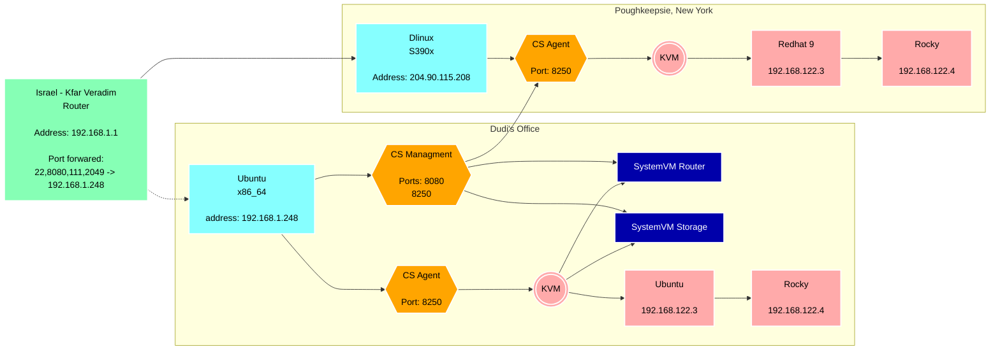
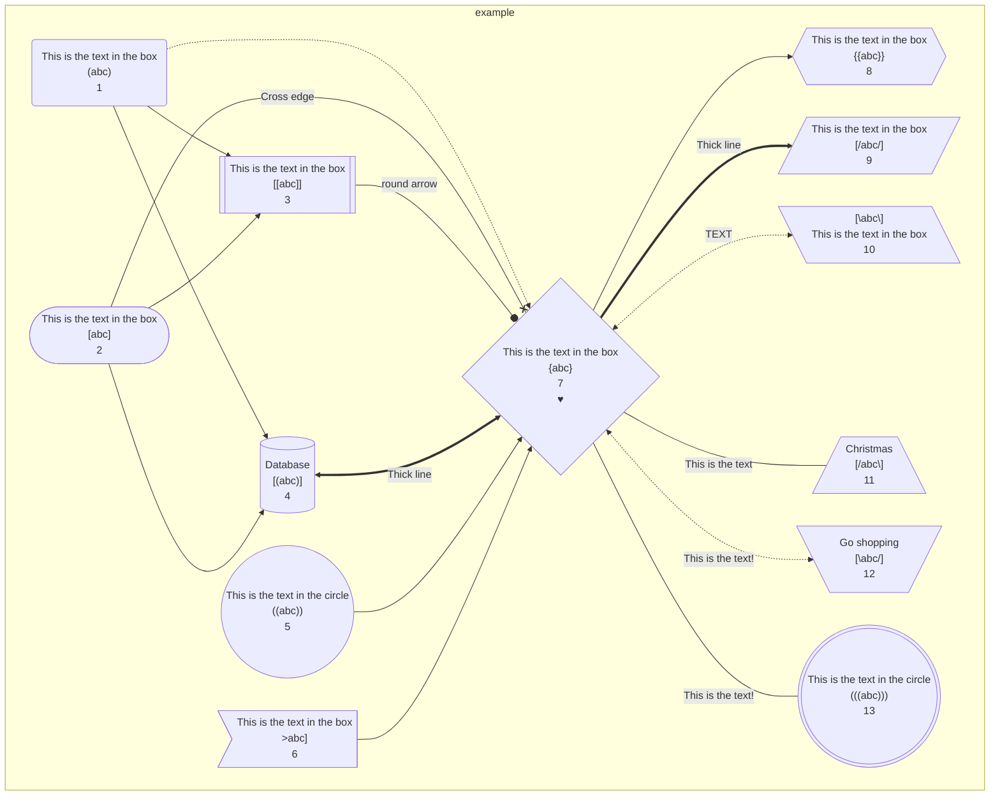

Log-On CloudStack  Plan

```mermaid

flowchart LR
  node_1["Israel - Kfar Veradim\nRouter\n\nAddress: 192.168.1.1\n\nPort forwared:\n22,8080,111,2049 -#gt; 192.168.1.248"]

  subgraph Dudi's Office
    node_2["Ubuntu\nx86_64\n\naddress: 192.168.1.248"]
    node_4((("KVM")))
    node_6["SystemVM Router"]
    node_7["SystemVM Storage"]
    node_14{{"CS Managment\n\nPorts: 8080\n8250"}}
    node_15{{"CS Agent\n\nPort: 8250"}}
    node_8["Ubuntu\n\n192.168.122.3"]
    node_12["Rocky\n\n192.168.122.4"]
  end

  subgraph "Poughkeepsie, New York"
    node_3["Dlinux\nS390x\n\nAddress: 204.90.115.208"]
    node_11["Redhat 9\n\n192.168.122.3"]
    node_13["Rocky\n\n192.168.122.4"]
    node_5((("KVM")))
    node_16{{"CS Agent\n\nPort: 8250"}}
  end
    
  node_1 -.-> node_2
  node_1 --> node_3
  node_4 --> node_6
  node_4 --> node_7
  node_4 --> node_8
  node_5 --> node_11
  node_8 --> node_12
  node_11 --> node_13
  node_2 --> node_14
  node_14 --> node_6
  node_14 --> node_7
  node_14 --> node_16
  node_2 --> node_15
  node_15 --> node_4
  node_3 --> node_16
  node_16 --> node_5
  style node_1 fill:#86FFB5,color:#000,stroke:#fff,stroke-width:2px
  style node_2 fill:#86FFff,color:#000,stroke:#fff,stroke-width:2px
  style node_3 fill:#86FFff,color:#000,stroke:#fff,stroke-width:2px
  style node_4 fill:#ffaaaa,color:#000,stroke:#fff,stroke-width:2px
  style node_5 fill:#ffaaaa,color:#000,stroke:#fff,stroke-width:2px
  style node_6 fill:#0000aa,color:#fff,stroke:#fff,stroke-width:2px
  style node_7 fill:#0000aa,color:#fff,stroke:#fff,stroke-width:2px
  style node_8 fill:#ffaaaa,color:#000,stroke:#fff,stroke-width:2px
  style node_11 fill:#ffaaaa,color:#000,stroke:#fff,stroke-width:2px
  style node_12 fill:#ffaaaa,color:#000,stroke:#fff,stroke-width:2px
  style node_13 fill:#ffaaaa,color:#000,stroke:#fff,stroke-width:2px
  style node_14 fill:orange,color:#000,stroke:#fff,stroke-width:2px
  style node_15 fill:orange,color:#000,stroke:#fff,stroke-width:2px
  style node_16 fill:orange,color:#000,stroke:#fff,stroke-width:2px

```
        Example of all kind of nodes

```mermaid
graph TB
subgraph example
  id1("This is the text in the box<br>(abc)<br>1") &  id2(["This is the text in the box<br>[abc]<br>2"]) -->   id3[["This is the text in the box<br>[[abc]]<br>3"]] &   id4[("Database<br>[(abc)]<br>4")]
  id5(("This is the text in the circle<br>((abc))<br>5"))
  id6>"This is the text in the box<br>>abc]<br>6"]   
  id7{"This is the text in the box<br>{abc}<br>7\n#9829;"}
  id8{{"This is the text in the box<br>{{abc}}<br>8"}}
  id9[/"This is the text in the box<br>[/abc/]<br>9"/]
  id10[\"[\abc\]<br>This is the text in the box<br>10"\]
  id11[/"Christmas<br>[/abc\]<br>11"\]
  id12[\"Go shopping<br>[\abc/]<br>12"/]
  id13((("This is the text in the circle<br>(((abc)))<br>13")))
end

  id1 -.-> id7
  id2 --x|Cross edge| id7
  id3 --o|round arrow| id7
  id4 <==Thick line==> id7
  id5 -->  id7 
  id6 -->  id7 
  id7 --> id8
  
  id7 ==Thick line==> id9
  id7 <-.TEXT.-> id10
  id7---|This is the text|id11
  id7 <-. This is the text! .-> id12
  id7 -- This is the text! --- id13

```
