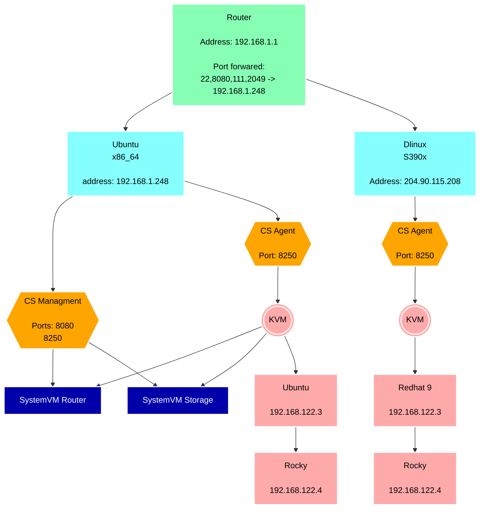

CloudStack

```mermaid

flowchart TB
  node_1["Router\n\nAddress: 192.168.1.1\n\nPort forwared:\n22,8080,111,2049 -#gt; 192.168.1.248"]
  node_2["Ubuntu\nx86_64\n\naddress: 192.168.1.248"]
  node_3["Dlinux\nS390x\n\nAddress: 204.90.115.208"]
  node_4((("KVM")))
  node_5((("KVM")))
  node_6["SystemVM Router"]
  node_7["SystemVM Storage"]
  node_8["Ubuntu\n\n192.168.122.3"]
  node_12["Rocky\n\n192.168.122.4"]
  node_11["Redhat 9\n\n192.168.122.3"]
  node_13["Rocky\n\n192.168.122.4"]
  node_14{{"CS Managment\n\nPorts: 8080\n8250"}}
  node_15{{"CS Agent\n\nPort: 8250"}}
  node_16{{"CS Agent\n\nPort: 8250"}}
  node_1 --> node_2
  node_1 --> node_3
  node_4 --> node_6
  node_4 --> node_7
  node_4 --> node_8
  node_5 --> node_11
  node_8 --> node_12
  node_11 --> node_13
  node_2 --> node_14
  node_14 --> node_6
  node_14 --> node_7
  node_2 --> node_15
  node_15 --> node_4
  node_3 --> node_16
  node_16 --> node_5
  style node_1 fill:#86FFB5,color:#000,stroke:#fff,stroke-width:2px
  style node_2 fill:#86FFff,color:#000,stroke:#fff,stroke-width:2px
  style node_3 fill:#86FFff,color:#000,stroke:#fff,stroke-width:2px
  style node_4 fill:#ffaaaa,color:#000,stroke:#fff,stroke-width:2px
  style node_5 fill:#ffaaaa,color:#000,stroke:#fff,stroke-width:2px
  style node_6 fill:#0000aa,color:#fff,stroke:#fff,stroke-width:2px
  style node_7 fill:#0000aa,color:#fff,stroke:#fff,stroke-width:2px
  style node_8 fill:#ffaaaa,color:#000,stroke:#fff,stroke-width:2px
  style node_11 fill:#ffaaaa,color:#000,stroke:#fff,stroke-width:2px
  style node_12 fill:#ffaaaa,color:#000,stroke:#fff,stroke-width:2px
  style node_13 fill:#ffaaaa,color:#000,stroke:#fff,stroke-width:2px
  style node_14 fill:orange,color:#000,stroke:#fff,stroke-width:2px
  style node_15 fill:orange,color:#000,stroke:#fff,stroke-width:2px
  style node_16 fill:orange,color:#000,stroke:#fff,stroke-width:2px

```
